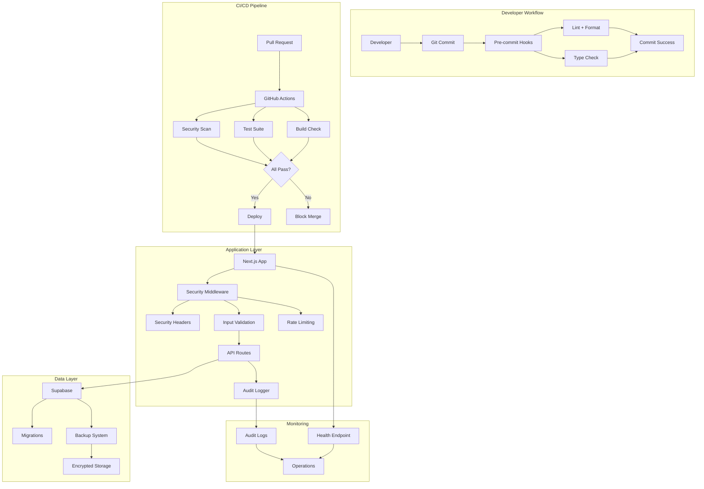

# Design Document: Production Readiness Infrastructure

## Overview

This design establishes production-grade infrastructure for the Parcel Admin Dashboard, transforming it from a development prototype into a reliable, secure, and maintainable production system. The design addresses 28 requirements across eight key areas: CI/CD automation, comprehensive testing, security hardening, development tooling, production operations, database management, compliance, and code quality.

The infrastructure follows a layered approach where each component builds upon established patterns in the Next.js ecosystem while maintaining compatibility with existing validation commands and the repository's AGENTS.md policy.

### Design Principles

1. **Incremental Enhancement**: All additions must maintain backward compatibility with existing functionality
2. **Zero-Downtime Operations**: Health checks and graceful shutdown enable safe deployments
3. **Security by Default**: Security headers, input validation, and audit logging are mandatory, not optional
4. **Developer Experience**: Automated tooling reduces manual effort and catches issues early
5. **Observability**: Comprehensive logging, metrics, and health checks provide operational visibility
6. **Compliance First**: Audit trails and data retention policies are built into the architecture

### Key Architectural Decisions

**Testing Strategy**: Dual approach using Vitest for fast unit/integration tests and Playwright for E2E tests, avoiding the overhead of Jest while maintaining React Testing Library compatibility.

**CI/CD Platform**: GitHub Actions chosen for native integration with the repository, free tier adequacy, and extensive ecosystem support.

**Security Layer**: Next.js middleware for security headers provides centralized control without modifying individual routes.

**Container Strategy**: Docker Compose for local development with Supabase local instance, avoiding production containerization complexity initially.

**Validation Framework**: Zod selected for type-safe runtime validation with TypeScript integration, replacing ad-hoc validation patterns.

## Architecture


### System Architecture Diagram



### Layer Responsibilities

**Pre-Commit Layer**: Husky + lint-staged execute fast checks (linting, formatting, type checking) before commits reach the repository, preventing broken code from entering version control.

**CI/CD Layer**: GitHub Actions workflow orchestrates build verification, comprehensive test execution, and security scanning on every pull request, providing a quality gate before merge.

**Security Layer**: Next.js middleware applies security headers, validates inputs with Zod schemas, and enforces rate limits, creating a defense-in-depth approach.

**Application Layer**: Next.js App Router handles routing and rendering, with API routes implementing business logic and integrating with Supabase.

**Data Layer**: Supabase provides PostgreSQL database with migration system, automated backups, and point-in-time recovery capabilities.

**Monitoring Layer**: Health endpoints, audit logging, and graceful shutdown handlers provide operational visibility and reliability.

## Components and Interfaces

### 1. CI/CD Pipeline Component

**Purpose**: Automate quality checks and provide merge confidence

**Implementation**: `.github/workflows/ci.yml`

**Job Structure**:
```yaml
jobs:
  build:
    - Checkout code
    - Setup Node.js 20.x with caching
    - Install dependencies
    - Run build
    
  test:
    - Checkout code
    - Setup Node.js 20.x with caching
    - Install dependencies
    - Run unit tests (Vitest)
    - Run integration tests
    - Upload coverage reports
    
  lint:
    - Checkout code
    - Setup Node.js 20.x with caching
    - Install dependencies
    - Run ESLint
    - Run type checking
    - Verify formatting (Prettier)
    
  security:
    - Checkout code
    - Run npm audit
    - Check for critical vulnerabilities
    
  e2e:
    - Checkout code
    - Setup Node.js 20.x with caching
    - Install dependencies
    - Install Playwright browsers
    - Start test database
    - Run E2E tests
    - Upload test artifacts
```

**Caching Strategy**: Cache `node_modules` based on `package-lock.json` hash, cache Playwright browsers based on version.

**Performance Target**: Complete all jobs in parallel within 10 minutes.

**Failure Handling**: Each job reports status independently; any failure blocks merge.


### 2. Testing Framework Component

**Purpose**: Provide fast, reliable automated testing across unit, integration, and E2E levels

**Technology Stack**:
- **Vitest**: Unit and integration test runner (faster than Jest, native ESM support)
- **React Testing Library**: Component testing utilities
- **Playwright**: E2E browser automation
- **@vitest/coverage-v8**: Code coverage reporting

**Configuration Files**:
- `vitest.config.ts`: Vitest configuration with React support
- `playwright.config.ts`: Playwright configuration for E2E tests
- `vitest.setup.ts`: Global test setup and mocks

**Test Organization**:
```
tests/
├── unit/
│   ├── components/          # Component tests
│   ├── lib/                 # Utility function tests
│   └── api/                 # API route unit tests
├── integration/
│   ├── api/                 # API integration tests with mocked Supabase
│   └── workflows/           # Multi-component integration tests
└── e2e/
    ├── auth.spec.ts         # Authentication flow
    ├── upload.spec.ts       # Data upload workflow
    └── dashboard.spec.ts    # Dashboard visualization
```

**Vitest Configuration**:
```typescript
{
  test: {
    environment: 'jsdom',
    setupFiles: ['./vitest.setup.ts'],
    coverage: {
      provider: 'v8',
      reporter: ['text', 'json', 'html'],
      exclude: ['node_modules/', 'tests/', '.next/'],
      thresholds: {
        lines: 60,
        functions: 60,
        branches: 60,
        statements: 60
      }
    }
  }
}
```

**Playwright Configuration**:
```typescript
{
  testDir: './tests/e2e',
  timeout: 30000,
  retries: 2,
  workers: 1,
  use: {
    baseURL: 'http://localhost:3000',
    trace: 'on-first-retry',
    screenshot: 'only-on-failure'
  },
  projects: [
    { name: 'chromium', use: { ...devices['Desktop Chrome'] } }
  ]
}
```

**Mock Strategy**:
- Supabase client mocked using Vitest's `vi.mock()`
- API responses mocked with predefined fixtures
- File uploads mocked with test data
- Time-dependent tests use `vi.useFakeTimers()`

**Test Execution**:
- Unit tests: `npm run test:unit` (< 30 seconds)
- Integration tests: `npm run test:integration` (< 60 seconds)
- E2E tests: `npm run test:e2e` (runs against test database)
- All tests: `npm run test` (runs unit + integration + E2E)


### 3. Security Layer Component

**Purpose**: Protect against common web vulnerabilities and enforce security best practices

**Implementation Files**:
- `lib/middleware/security-headers.ts`: Security headers middleware
- `lib/validation/schemas.ts`: Zod validation schemas
- `lib/validation/sanitize.ts`: Input sanitization utilities
- `middleware.ts`: Next.js middleware entry point

**Security Headers Configuration**:
```typescript
{
  'Content-Security-Policy': "default-src 'self'; script-src 'self' 'unsafe-eval' 'unsafe-inline'; style-src 'self' 'unsafe-inline'; img-src 'self' data: https:; font-src 'self' data:; connect-src 'self' https://*.supabase.co",
  'Strict-Transport-Security': 'max-age=31536000; includeSubDomains',
  'X-Frame-Options': 'DENY',
  'X-Content-Type-Options': 'nosniff',
  'Referrer-Policy': 'strict-origin-when-cross-origin',
  'Permissions-Policy': 'camera=(), microphone=(), geolocation=()'
}
```

**Validation Schema Pattern**:
```typescript
// Example API route validation
const uploadSchema = z.object({
  file: z.instanceof(File)
    .refine(file => file.size <= 10 * 1024 * 1024, 'File must be under 10MB')
    .refine(file => ['text/csv', 'application/vnd.ms-excel'].includes(file.type), 'Must be CSV'),
  type: z.enum(['parcel', 'delivery', 'collector', 'prepare'])
});

// Usage in API route
export async function POST(request: NextRequest) {
  const formData = await request.formData();
  const result = uploadSchema.safeParse({
    file: formData.get('file'),
    type: formData.get('type')
  });
  
  if (!result.success) {
    return NextResponse.json(
      { error: 'Validation failed', details: result.error.format() },
      { status: 400 }
    );
  }
  // Process validated data
}
```

**Input Sanitization**:
- HTML entities escaped in user-provided strings
- SQL injection prevented by Supabase parameterized queries
- Path traversal prevented by validating file paths
- XSS prevented by sanitizing before rendering

**CORS Configuration** (documented in `docs/security/cors.md`):
```typescript
{
  development: {
    origins: ['http://localhost:3000'],
    methods: ['GET', 'POST', 'PUT', 'DELETE'],
    allowedHeaders: ['Content-Type', 'Authorization']
  },
  production: {
    origins: [process.env.NEXT_PUBLIC_APP_URL],
    methods: ['GET', 'POST', 'PUT', 'DELETE'],
    allowedHeaders: ['Content-Type', 'Authorization']
  }
}
```

**Rate Limiting** (existing implementation documented in `docs/security/rate-limiting.md`):
- Current implementation uses Supabase RPC `check_rate_limit`
- Thresholds: 100 requests per minute per IP
- Window: 60 seconds sliding window
- Response headers: `X-RateLimit-Limit`, `X-RateLimit-Remaining`, `X-RateLimit-Reset`
- Bypass: Test environment uses `RATE_LIMIT_BYPASS=true`


### 4. Development Tooling Component

**Purpose**: Standardize development environment and automate code quality checks

**Docker Compose Configuration** (`docker-compose.yml`):
```yaml
services:
  app:
    build: .
    ports:
      - "3000:3000"
    volumes:
      - .:/app
      - /app/node_modules
    environment:
      - NODE_ENV=development
    depends_on:
      - supabase
    
  supabase:
    image: supabase/postgres:15
    ports:
      - "54322:5432"
    environment:
      - POSTGRES_PASSWORD=postgres
    volumes:
      - supabase-data:/var/lib/postgresql/data
      - ./supabase/migrations:/docker-entrypoint-initdb.d

volumes:
  supabase-data:
```

**Dockerfile**:
```dockerfile
FROM node:20-alpine
WORKDIR /app
COPY package*.json ./
RUN npm ci
COPY . .
EXPOSE 3000
CMD ["npm", "run", "dev"]
```

**Pre-commit Hooks** (Husky + lint-staged):

`.husky/pre-commit`:
```bash
#!/bin/sh
npx lint-staged
npx commitlint --edit $1
```

`package.json` lint-staged configuration:
```json
{
  "lint-staged": {
    "*.{ts,tsx}": [
      "eslint --fix",
      "prettier --write",
      "tsc --noEmit"
    ],
    "*.{json,md,css}": [
      "prettier --write"
    ]
  }
}
```

**Prettier Configuration** (`.prettierrc.json`):
```json
{
  "semi": true,
  "trailingComma": "es5",
  "singleQuote": false,
  "printWidth": 100,
  "tabWidth": 2,
  "useTabs": false
}
```

**Commitlint Configuration** (`.commitlintrc.json`):
```json
{
  "extends": ["@commitlint/config-conventional"],
  "rules": {
    "type-enum": [2, "always", [
      "feat", "fix", "docs", "style", "refactor", "test", "chore"
    ]],
    "subject-case": [2, "always", "sentence-case"]
  }
}
```

**VS Code Configuration** (`.vscode/settings.json`):
```json
{
  "editor.formatOnSave": true,
  "editor.defaultFormatter": "esbenp.prettier-vscode",
  "editor.codeActionsOnSave": {
    "source.fixAll.eslint": true
  },
  "typescript.tsdk": "node_modules/typescript/lib",
  "typescript.enablePromptUseWorkspaceTsdk": true
}
```

**VS Code Extensions** (`.vscode/extensions.json`):
```json
{
  "recommendations": [
    "dbaeumer.vscode-eslint",
    "esbenp.prettier-vscode",
    "ms-playwright.playwright",
    "bradlc.vscode-tailwindcss"
  ]
}
```

**VS Code Debug Configuration** (`.vscode/launch.json`):
```json
{
  "configurations": [
    {
      "name": "Next.js: debug server-side",
      "type": "node-terminal",
      "request": "launch",
      "command": "npm run dev"
    },
    {
      "name": "Next.js: debug client-side",
      "type": "chrome",
      "request": "launch",
      "url": "http://localhost:3000"
    }
  ]
}
```


### 5. Production Operations Component

**Purpose**: Enable reliable production deployments and operational monitoring

**Health Check Endpoint** (`app/api/health/route.ts`):
```typescript
export async function GET() {
  const startTime = Date.now();
  const checks = {
    database: false,
    timestamp: new Date().toISOString(),
    version: process.env.npm_package_version || 'unknown'
  };
  
  try {
    const supabase = getSupabaseAdminClient();
    const { error } = await supabase.from('parcel_logs').select('count').limit(1);
    checks.database = !error;
  } catch (error) {
    checks.database = false;
  }
  
  const responseTime = Date.now() - startTime;
  const status = checks.database ? 200 : 503;
  
  return NextResponse.json(
    { ...checks, responseTime },
    { status }
  );
}
```

**Graceful Shutdown Handler** (`lib/server/shutdown.ts`):
```typescript
let isShuttingDown = false;
const activeRequests = new Set<Promise<void>>();

export function registerRequest(promise: Promise<void>) {
  if (isShuttingDown) {
    throw new Error('Server is shutting down');
  }
  activeRequests.add(promise);
  promise.finally(() => activeRequests.delete(promise));
}

export function setupGracefulShutdown() {
  const shutdown = async (signal: string) => {
    console.log(`Received ${signal}, starting graceful shutdown`);
    isShuttingDown = true;
    
    // Wait for active requests with timeout
    const timeout = setTimeout(() => {
      console.log('Shutdown timeout reached, forcing exit');
      process.exit(1);
    }, 30000);
    
    await Promise.all(activeRequests);
    clearTimeout(timeout);
    
    // Close database connections
    // Supabase client handles this automatically
    
    console.log('Graceful shutdown complete');
    process.exit(0);
  };
  
  process.on('SIGTERM', () => shutdown('SIGTERM'));
  process.on('SIGINT', () => shutdown('SIGINT'));
}
```

**Performance Benchmarks** (`docs/operations/performance.md`):
```markdown
## Baseline Performance Metrics

### API Endpoints (95th percentile)
- GET /api/dashboard: 250ms
- POST /api/upload: 2000ms (depends on file size)
- GET /api/compare-periods: 500ms
- GET /api/health: 50ms

### Page Load Times (First Contentful Paint)
- /dashboard: 1.2s
- /upload: 800ms
- /data-quality: 1.5s

### Database Query Performance
- Parcel logs aggregation: 300ms (10k rows)
- Delivery details join: 450ms (5k rows)
- Time-series queries: 200ms (30 days)

### Testing Methodology
- Load testing: k6 with 10 concurrent users
- Browser testing: Lighthouse CI
- Database testing: EXPLAIN ANALYZE on critical queries

### Acceptable Thresholds
- API endpoints: < 1s for 95th percentile
- Page loads: < 2s FCP
- Database queries: < 1s for complex aggregations
```


### 6. Database Management Component

**Purpose**: Ensure database reliability, recoverability, and development productivity

**Migration Rollback Scripts** (`supabase/migrations/rollback/`):

Each migration must have a corresponding rollback script:
```sql
-- supabase/migrations/rollback/20240115_rollback_add_audit_logs.sql
-- Rollback for: 20240115_add_audit_logs.sql

DROP TABLE IF EXISTS audit_logs;
DROP INDEX IF EXISTS idx_audit_logs_timestamp;
DROP INDEX IF EXISTS idx_audit_logs_user_id;
```

**Migration Testing Script** (`scripts/db/test-migration.sh`):
```bash
#!/bin/bash
set -e

MIGRATION_FILE=$1
ROLLBACK_FILE=$2

echo "Testing migration: $MIGRATION_FILE"

# Apply migration
psql $DATABASE_URL -f $MIGRATION_FILE

# Verify migration
echo "Migration applied successfully"

# Test rollback
psql $DATABASE_URL -f $ROLLBACK_FILE

# Verify rollback
echo "Rollback successful"

# Re-apply migration for final state
psql $DATABASE_URL -f $MIGRATION_FILE
```

**Seed Data Generator** (`scripts/db/seed.ts`):
```typescript
import { createClient } from '@supabase/supabase-js';

const supabase = createClient(
  process.env.SUPABASE_URL!,
  process.env.SUPABASE_SERVICE_KEY!
);

async function seed() {
  console.log('Seeding database...');
  
  // Idempotent: Clear existing seed data
  await supabase.from('parcel_logs').delete().eq('is_seed_data', true);
  await supabase.from('delivery_details').delete().eq('is_seed_data', true);
  
  // Generate sample parcels
  const parcels = Array.from({ length: 100 }, (_, i) => ({
    parcel_id: `SEED-${i.toString().padStart(5, '0')}`,
    created_date_local: new Date(Date.now() - Math.random() * 30 * 24 * 60 * 60 * 1000).toISOString(),
    is_seed_data: true
  }));
  
  await supabase.from('parcel_logs').insert(parcels);
  
  // Generate sample deliveries
  const deliveries = parcels.map(p => ({
    parcel_id: p.parcel_id,
    delivered_ts: new Date(new Date(p.created_date_local).getTime() + Math.random() * 24 * 60 * 60 * 1000).toISOString(),
    is_on_time: Math.random() > 0.2,
    is_seed_data: true
  }));
  
  await supabase.from('delivery_details').insert(deliveries);
  
  console.log('Seed data created successfully');
}

seed().catch(console.error);
```

**Backup Automation** (`scripts/db/backup.sh`):
```bash
#!/bin/bash
set -e

BACKUP_DIR="/backups"
TIMESTAMP=$(date +%Y%m%d_%H%M%S)
BACKUP_FILE="$BACKUP_DIR/backup_$TIMESTAMP.sql.gz"

# Create backup
pg_dump $DATABASE_URL | gzip > $BACKUP_FILE

# Verify backup integrity
gunzip -t $BACKUP_FILE

# Encrypt backup
openssl enc -aes-256-cbc -salt -in $BACKUP_FILE -out $BACKUP_FILE.enc -k $BACKUP_ENCRYPTION_KEY
rm $BACKUP_FILE

# Upload to storage (implementation depends on provider)
# aws s3 cp $BACKUP_FILE.enc s3://backups/

# Cleanup old backups
find $BACKUP_DIR -name "backup_*.sql.gz.enc" -mtime +7 -delete  # Daily backups > 7 days
find $BACKUP_DIR -name "backup_*_weekly.sql.gz.enc" -mtime +28 -delete  # Weekly backups > 4 weeks

echo "Backup completed: $BACKUP_FILE.enc"
```

**Backup Documentation** (`docs/database/backup-restore.md`):
```markdown
## Backup and Restore Procedures

### Automated Backup Schedule
- Daily backups: 02:00 UTC
- Retention: 7 days for daily, 4 weeks for weekly
- Storage: Encrypted at rest with AES-256
- Location: S3 bucket `parcel-admin-backups`

### Restore Procedure
1. Download encrypted backup: `aws s3 cp s3://backups/backup_TIMESTAMP.sql.gz.enc .`
2. Decrypt: `openssl enc -aes-256-cbc -d -in backup.sql.gz.enc -out backup.sql.gz -k $KEY`
3. Decompress: `gunzip backup.sql.gz`
4. Restore: `psql $DATABASE_URL < backup.sql`
5. Verify: Run validation queries from `sql/validation_queries.sql`

### Point-in-Time Recovery
Supabase provides PITR with 7-day retention. To restore:
1. Access Supabase dashboard
2. Navigate to Database > Backups
3. Select timestamp for recovery
4. Confirm restoration (creates new instance)

### Backup Verification
Weekly automated verification:
1. Restore backup to test instance
2. Run validation queries
3. Compare row counts with production
4. Alert if discrepancies found
```


### 7. Compliance Framework Component

**Purpose**: Meet regulatory requirements and provide audit trails

**Audit Logging Implementation** (`lib/audit/logger.ts`):
```typescript
import { createClient } from '@supabase/supabase-js';

export enum AuditEventType {
  AUTH_LOGIN = 'auth.login',
  AUTH_LOGOUT = 'auth.logout',
  DATA_UPLOAD = 'data.upload',
  DATA_DELETE = 'data.delete',
  CONFIG_CHANGE = 'config.change'
}

export interface AuditEvent {
  event_type: AuditEventType;
  user_id: string;
  ip_address: string;
  user_agent: string;
  resource_type?: string;
  resource_id?: string;
  metadata?: Record<string, any>;
}

export async function logAuditEvent(event: AuditEvent) {
  const supabase = createClient(
    process.env.SUPABASE_URL!,
    process.env.SUPABASE_SERVICE_KEY!
  );
  
  await supabase.from('audit_logs').insert({
    ...event,
    timestamp: new Date().toISOString()
  });
}

// Middleware wrapper for API routes
export function withAuditLog(
  handler: Function,
  eventType: AuditEventType,
  getResourceInfo?: (req: NextRequest) => { type: string; id: string }
) {
  return async (request: NextRequest) => {
    const response = await handler(request);
    
    if (response.status < 400) {
      const resourceInfo = getResourceInfo?.(request);
      await logAuditEvent({
        event_type: eventType,
        user_id: request.headers.get('x-user-id') || 'anonymous',
        ip_address: request.headers.get('x-forwarded-for') || request.ip || 'unknown',
        user_agent: request.headers.get('user-agent') || 'unknown',
        resource_type: resourceInfo?.type,
        resource_id: resourceInfo?.id
      });
    }
    
    return response;
  };
}
```

**Audit Logs Table Migration** (`supabase/migrations/20240115_add_audit_logs.sql`):
```sql
CREATE TABLE audit_logs (
  id BIGSERIAL PRIMARY KEY,
  timestamp TIMESTAMPTZ NOT NULL DEFAULT NOW(),
  event_type TEXT NOT NULL,
  user_id TEXT NOT NULL,
  ip_address TEXT NOT NULL,
  user_agent TEXT NOT NULL,
  resource_type TEXT,
  resource_id TEXT,
  metadata JSONB
);

CREATE INDEX idx_audit_logs_timestamp ON audit_logs(timestamp DESC);
CREATE INDEX idx_audit_logs_user_id ON audit_logs(user_id);
CREATE INDEX idx_audit_logs_event_type ON audit_logs(event_type);

-- Partition by month for performance
CREATE TABLE audit_logs_y2024m01 PARTITION OF audit_logs
  FOR VALUES FROM ('2024-01-01') TO ('2024-02-01');
```

**Data Retention Policy** (`docs/compliance/data-retention.md`):
```markdown
## Data Retention Policy

### Parcel Delivery Data
- **Retention Period**: 2 years from delivery date
- **Rationale**: Business analytics and dispute resolution
- **Deletion Process**: Automated monthly job deletes records older than 2 years
- **Archival**: Data archived to cold storage before deletion

### Audit Logs
- **Retention Period**: 7 years
- **Rationale**: Compliance with financial record-keeping regulations
- **Deletion Process**: Automated annual job deletes records older than 7 years
- **Archival**: Logs archived to immutable storage after 1 year

### User Session Data
- **Retention Period**: 30 days from last activity
- **Rationale**: Security and troubleshooting
- **Deletion Process**: Automated daily cleanup of expired sessions
- **Archival**: Not archived (ephemeral data)

### Deletion Procedures
1. Automated jobs run via cron: `scripts/compliance/cleanup.ts`
2. Soft delete with `deleted_at` timestamp
3. Hard delete after 30-day grace period
4. Deletion logged in audit trail

### Archival Procedures
1. Export to Parquet format for compression
2. Upload to S3 Glacier Deep Archive
3. Maintain index of archived data
4. Restore process documented in runbook

### Regulatory Compliance
- GDPR: Right to erasure implemented via `scripts/compliance/gdpr-delete.ts`
- CCPA: Data export implemented via `scripts/compliance/data-export.ts`
- SOC 2: Audit logs provide evidence of access controls
```

**Data Retention Automation** (`scripts/compliance/cleanup.ts`):
```typescript
import { createClient } from '@supabase/supabase-js';

const supabase = createClient(
  process.env.SUPABASE_URL!,
  process.env.SUPABASE_SERVICE_KEY!
);

async function cleanupOldData() {
  const twoYearsAgo = new Date();
  twoYearsAgo.setFullYear(twoYearsAgo.getFullYear() - 2);
  
  // Soft delete old parcel data
  const { data: oldParcels } = await supabase
    .from('parcel_logs')
    .update({ deleted_at: new Date().toISOString() })
    .lt('created_date_local', twoYearsAgo.toISOString())
    .is('deleted_at', null)
    .select('parcel_id');
  
  console.log(`Marked ${oldParcels?.length || 0} parcels for deletion`);
  
  // Hard delete after grace period
  const gracePeriod = new Date();
  gracePeriod.setDate(gracePeriod.getDate() - 30);
  
  await supabase
    .from('parcel_logs')
    .delete()
    .lt('deleted_at', gracePeriod.toISOString());
}

cleanupOldData().catch(console.error);
```


### 8. Code Quality System Component

**Purpose**: Maintain consistent code standards and streamline collaboration

**GitHub Templates** (`.github/PULL_REQUEST_TEMPLATE.md`):
```markdown
## Description
<!-- Provide a clear description of the changes -->

## Type of Change
- [ ] Bug fix (non-breaking change which fixes an issue)
- [ ] New feature (non-breaking change which adds functionality)
- [ ] Breaking change (fix or feature that would cause existing functionality to not work as expected)
- [ ] Documentation update

## Testing Performed
<!-- Describe the tests you ran and their results -->
- [ ] Unit tests added/updated
- [ ] Integration tests added/updated
- [ ] E2E tests added/updated
- [ ] Manual testing performed

## Breaking Changes
<!-- List any breaking changes and migration steps -->

## Checklist
- [ ] Code follows project style guidelines
- [ ] Self-review completed
- [ ] Comments added for complex logic
- [ ] Documentation updated
- [ ] No new warnings generated
- [ ] Tests pass locally
- [ ] Dependent changes merged
```

**Bug Report Template** (`.github/ISSUE_TEMPLATE/bug_report.md`):
```markdown
---
name: Bug Report
about: Report a bug to help us improve
title: '[BUG] '
labels: bug
---

## Description
<!-- Clear description of the bug -->

## Reproduction Steps
1. Go to '...'
2. Click on '...'
3. Scroll down to '...'
4. See error

## Expected Behavior
<!-- What should happen -->

## Actual Behavior
<!-- What actually happens -->

## Environment
- Browser: [e.g. Chrome 120]
- OS: [e.g. macOS 14]
- App Version: [e.g. 0.1.0]

## Screenshots
<!-- If applicable, add screenshots -->

## Additional Context
<!-- Any other relevant information -->
```

**Feature Request Template** (`.github/ISSUE_TEMPLATE/feature_request.md`):
```markdown
---
name: Feature Request
about: Suggest a new feature
title: '[FEATURE] '
labels: enhancement
---

## Use Case
<!-- Describe the problem this feature would solve -->

## Proposed Solution
<!-- Describe your proposed solution -->

## Alternatives Considered
<!-- Describe alternative solutions you've considered -->

## Additional Context
<!-- Any other relevant information, mockups, or examples -->
```

**Code Review Guidelines** (`docs/contributing/code-review.md`):
```markdown
## Code Review Guidelines

### Review Checklist

#### Functionality
- [ ] Code solves the stated problem
- [ ] Edge cases handled appropriately
- [ ] Error handling is comprehensive
- [ ] No obvious bugs or logic errors

#### Code Quality
- [ ] Code is readable and self-documenting
- [ ] Functions are focused and single-purpose
- [ ] No unnecessary complexity
- [ ] Follows DRY principle
- [ ] Consistent with existing codebase style

#### Testing
- [ ] Adequate test coverage (>60%)
- [ ] Tests are meaningful and not just for coverage
- [ ] Edge cases tested
- [ ] Integration points tested

#### Security
- [ ] No hardcoded secrets or credentials
- [ ] Input validation present
- [ ] SQL injection prevented
- [ ] XSS vulnerabilities addressed
- [ ] Authentication/authorization checked

#### Performance
- [ ] No obvious performance issues
- [ ] Database queries optimized
- [ ] Large datasets handled efficiently
- [ ] No memory leaks

#### Documentation
- [ ] Public APIs documented
- [ ] Complex logic explained
- [ ] README updated if needed
- [ ] Migration guide for breaking changes

### Response Time Expectations
- Initial review: Within 24 hours
- Follow-up reviews: Within 12 hours
- Urgent fixes: Within 4 hours

### Approval Requirements
- Minimum 1 approval required
- 2 approvals for breaking changes
- Security team approval for security-related changes

### Providing Feedback
- Be constructive and specific
- Explain the "why" behind suggestions
- Distinguish between blocking issues and suggestions
- Acknowledge good work
- Use conventional comment prefixes:
  - `nit:` Minor style suggestion
  - `question:` Seeking clarification
  - `blocking:` Must be addressed before merge
  - `suggestion:` Optional improvement
```

**License File** (`LICENSE`):
```
MIT License

Copyright (c) 2024 [Copyright Holder]

Permission is hereby granted, free of charge, to any person obtaining a copy
of this software and associated documentation files (the "Software"), to deal
in the Software without restriction, including without limitation the rights
to use, copy, modify, merge, publish, distribute, sublicense, and/or sell
copies of the Software, and to permit persons to whom the Software is
furnished to do so, subject to the following conditions:

The above copyright notice and this permission notice shall be included in all
copies or substantial portions of the Software.

THE SOFTWARE IS PROVIDED "AS IS", WITHOUT WARRANTY OF ANY KIND, EXPRESS OR
IMPLIED, INCLUDING BUT NOT LIMITED TO THE WARRANTIES OF MERCHANTABILITY,
FITNESS FOR A PARTICULAR PURPOSE AND NONINFRINGEMENT. IN NO EVENT SHALL THE
AUTHORS OR COPYRIGHT HOLDERS BE LIABLE FOR ANY CLAIM, DAMAGES OR OTHER
LIABILITY, WHETHER IN AN ACTION OF CONTRACT, TORT OR OTHERWISE, ARISING FROM,
OUT OF OR IN CONNECTION WITH THE SOFTWARE OR THE USE OR OTHER DEALINGS IN THE
SOFTWARE.
```

**Dependabot Configuration** (`.github/dependabot.yml`):
```yaml
version: 2
updates:
  - package-ecosystem: "npm"
    directory: "/"
    schedule:
      interval: "daily"
      time: "03:00"
    open-pull-requests-limit: 10
    reviewers:
      - "team-leads"
    labels:
      - "dependencies"
    commit-message:
      prefix: "chore"
      include: "scope"
    ignore:
      - dependency-name: "*"
        update-types: ["version-update:semver-major"]
    groups:
      dev-dependencies:
        patterns:
          - "@types/*"
          - "eslint*"
          - "prettier"
```

## Data Models


### Audit Logs Table

**Purpose**: Store security-relevant events for compliance and investigation

**Schema**:
```typescript
interface AuditLog {
  id: bigint;                    // Primary key
  timestamp: string;             // ISO 8601 timestamp
  event_type: string;            // Enum: auth.login, data.upload, etc.
  user_id: string;               // User identifier
  ip_address: string;            // Client IP address
  user_agent: string;            // Browser user agent
  resource_type?: string;        // Type of resource affected
  resource_id?: string;          // ID of resource affected
  metadata?: Record<string, any>; // Additional event-specific data
}
```

**Indexes**:
- Primary key on `id`
- Index on `timestamp DESC` for time-range queries
- Index on `user_id` for user activity queries
- Index on `event_type` for event filtering

**Partitioning**: Monthly partitions for performance and archival

**Retention**: 7 years (compliance requirement)

### Test Coverage Report

**Purpose**: Track test coverage metrics

**Schema**:
```typescript
interface CoverageReport {
  timestamp: string;
  commit_sha: string;
  branch: string;
  lines: {
    total: number;
    covered: number;
    percentage: number;
  };
  functions: {
    total: number;
    covered: number;
    percentage: number;
  };
  branches: {
    total: number;
    covered: number;
    percentage: number;
  };
  statements: {
    total: number;
    covered: number;
    percentage: number;
  };
}
```

**Storage**: JSON files in CI artifacts, not in database

### Seed Data Markers

**Purpose**: Identify test/development data for safe cleanup

**Implementation**: Add `is_seed_data: boolean` column to relevant tables

**Migration**:
```sql
ALTER TABLE parcel_logs ADD COLUMN is_seed_data BOOLEAN DEFAULT FALSE;
ALTER TABLE delivery_details ADD COLUMN is_seed_data BOOLEAN DEFAULT FALSE;

CREATE INDEX idx_parcel_logs_seed ON parcel_logs(is_seed_data) WHERE is_seed_data = TRUE;
CREATE INDEX idx_delivery_details_seed ON delivery_details(is_seed_data) WHERE is_seed_data = TRUE;
```

## Error Handling

### CI/CD Pipeline Errors

**Build Failures**:
- **Detection**: Build job exits with non-zero code
- **Response**: Block PR merge, comment on PR with error details
- **Recovery**: Developer fixes build errors and pushes new commit
- **Notification**: GitHub PR status check shows failure

**Test Failures**:
- **Detection**: Test job exits with non-zero code or coverage below threshold
- **Response**: Block PR merge, upload test artifacts (screenshots, logs)
- **Recovery**: Developer fixes failing tests or improves coverage
- **Notification**: GitHub PR status check shows failure with test summary

**Security Vulnerabilities**:
- **Detection**: `npm audit` finds critical vulnerabilities
- **Response**: Block PR merge, create security issue
- **Recovery**: Update vulnerable dependencies or apply patches
- **Notification**: GitHub Security Advisory created

### Runtime Errors

**Health Check Failures**:
- **Detection**: `/api/health` returns 503 status
- **Response**: Load balancer removes instance from rotation
- **Recovery**: Automatic restart via orchestration platform
- **Notification**: Alert sent to operations team

**Database Connection Errors**:
- **Detection**: Supabase client throws connection error
- **Response**: Return 503 to client, log error with context
- **Recovery**: Retry with exponential backoff (3 attempts)
- **Notification**: Alert if errors persist > 5 minutes

**Validation Errors**:
- **Detection**: Zod schema validation fails
- **Response**: Return 400 with detailed error messages
- **Recovery**: Client displays validation errors to user
- **Notification**: None (expected user error)

**Rate Limit Exceeded**:
- **Detection**: Rate limit check returns false
- **Response**: Return 429 with Retry-After header
- **Recovery**: Client waits and retries
- **Notification**: Alert if single IP exceeds limit repeatedly

### Graceful Degradation

**Database Unavailable**:
- Health endpoint returns 503
- API routes return cached data if available
- Upload functionality disabled with user-friendly message

**External Service Failures**:
- Timeout after 5 seconds
- Return partial data with warning
- Log failure for investigation

## Testing Strategy


### Testing Approach

The testing strategy employs a dual approach combining unit tests for specific examples and edge cases with property-based tests for universal correctness properties. This provides comprehensive coverage while avoiding redundant test cases.

**Unit Testing Focus**:
- Specific examples demonstrating correct behavior
- Edge cases (empty inputs, boundary values, special characters)
- Error conditions and validation failures
- Integration points between components
- Regression tests for known bugs

**Property-Based Testing Focus**:
- Universal properties that hold for all inputs
- Comprehensive input coverage through randomization
- Invariants that must be maintained
- Round-trip properties (serialize/deserialize, encode/decode)
- Metamorphic properties (relationships between operations)

**Testing Balance**: Avoid writing excessive unit tests for scenarios that property-based tests already cover. Property tests handle "for all inputs" scenarios, while unit tests handle specific examples and edge cases.

### Test Configuration

**Vitest Configuration** (`vitest.config.ts`):
```typescript
import { defineConfig } from 'vitest/config';
import react from '@vitejs/plugin-react';

export default defineConfig({
  plugins: [react()],
  test: {
    environment: 'jsdom',
    setupFiles: ['./vitest.setup.ts'],
    coverage: {
      provider: 'v8',
      reporter: ['text', 'json', 'html'],
      exclude: [
        'node_modules/',
        'tests/',
        '.next/',
        '**/*.config.ts',
        '**/*.d.ts'
      ],
      thresholds: {
        lines: 60,
        functions: 60,
        branches: 60,
        statements: 60
      }
    },
    globals: true,
    mockReset: true
  },
  resolve: {
    alias: {
      '@': '/app',
      '@/lib': '/lib',
      '@/components': '/components'
    }
  }
});
```

**Property Test Configuration**: Each property test must run minimum 100 iterations to ensure adequate randomization coverage.

**Test Tagging**: Each property-based test must include a comment tag referencing its design document property:
```typescript
// Feature: production-readiness-infrastructure, Property 1: Health check database connectivity
test('health endpoint verifies database connection', async () => {
  // Property test implementation
});
```

### Test Organization

```
tests/
├── unit/
│   ├── components/
│   │   ├── upload-form.test.tsx
│   │   ├── data-table.test.tsx
│   │   ├── chart-widget.test.tsx
│   │   ├── filter-panel.test.tsx
│   │   └── nav.test.tsx
│   ├── lib/
│   │   ├── validation/
│   │   │   ├── schemas.test.ts
│   │   │   └── sanitize.test.ts
│   │   ├── audit/
│   │   │   └── logger.test.ts
│   │   └── utils/
│   │       └── date-helpers.test.ts
│   └── api/
│       ├── health.test.ts
│       └── upload.test.ts
├── integration/
│   ├── api/
│   │   ├── compare-periods.test.ts
│   │   ├── dashboard.test.ts
│   │   └── upload-workflow.test.ts
│   └── workflows/
│       └── data-ingestion.test.ts
└── e2e/
    ├── auth.spec.ts
    ├── upload.spec.ts
    └── dashboard.spec.ts
```

### Example Test Cases

**Unit Test Example** (specific edge case):
```typescript
import { describe, it, expect } from 'vitest';
import { sanitizeInput } from '@/lib/validation/sanitize';

describe('sanitizeInput', () => {
  it('should escape HTML entities in user input', () => {
    const malicious = '<script>alert("xss")</script>';
    const sanitized = sanitizeInput(malicious);
    expect(sanitized).toBe('&lt;script&gt;alert(&quot;xss&quot;)&lt;/script&gt;');
  });
  
  it('should handle empty strings', () => {
    expect(sanitizeInput('')).toBe('');
  });
});
```

**Integration Test Example** (API with mocked Supabase):
```typescript
import { describe, it, expect, vi } from 'vitest';
import { GET } from '@/app/api/health/route';

vi.mock('@/lib/supabase/server', () => ({
  getSupabaseAdminClient: () => ({
    from: () => ({
      select: () => ({
        limit: () => Promise.resolve({ error: null })
      })
    })
  })
}));

describe('Health API', () => {
  it('should return 200 when database is healthy', async () => {
    const response = await GET();
    const data = await response.json();
    
    expect(response.status).toBe(200);
    expect(data.database).toBe(true);
    expect(data.timestamp).toBeDefined();
  });
});
```

**E2E Test Example** (complete user workflow):
```typescript
import { test, expect } from '@playwright/test';

test('user can upload CSV and view dashboard', async ({ page }) => {
  await page.goto('/login');
  await page.fill('[name="email"]', 'test@example.com');
  await page.fill('[name="password"]', 'password');
  await page.click('button[type="submit"]');
  
  await expect(page).toHaveURL('/dashboard');
  
  await page.goto('/upload');
  await page.setInputFiles('input[type="file"]', 'tests/fixtures/sample.csv');
  await page.selectOption('select[name="type"]', 'parcel');
  await page.click('button:has-text("Upload")');
  
  await expect(page.locator('.success-message')).toBeVisible();
  
  await page.goto('/dashboard');
  await expect(page.locator('.chart-container')).toBeVisible();
});
```

### CI Integration

Tests run in GitHub Actions with the following configuration:

```yaml
test:
  runs-on: ubuntu-latest
  steps:
    - uses: actions/checkout@v4
    - uses: actions/setup-node@v4
      with:
        node-version: '20'
        cache: 'npm'
    - run: npm ci
    - run: npm run test:unit -- --coverage
    - run: npm run test:integration
    - uses: actions/upload-artifact@v4
      if: always()
      with:
        name: coverage-report
        path: coverage/
```

Now I need to perform the prework analysis before writing the Correctness Properties section.


## Correctness Properties

A property is a characteristic or behavior that should hold true across all valid executions of a system—essentially, a formal statement about what the system should do. Properties serve as the bridge between human-readable specifications and machine-verifiable correctness guarantees.

### Property 1: Security Headers on All Responses

For any HTTP response from the application, the response must include all required security headers (Content-Security-Policy, Strict-Transport-Security, X-Frame-Options with value DENY, X-Content-Type-Options with value nosniff, Referrer-Policy with value strict-origin-when-cross-origin, and Permissions-Policy) with their correct values.

**Validates: Requirements 6.1, 6.2, 6.3, 6.4, 6.5, 6.6**

### Property 2: API Input Validation

For any API route, all request inputs (body and query parameters) must be validated before processing, and invalid inputs must result in HTTP 400 responses with descriptive error messages.

**Validates: Requirements 7.2, 7.3, 7.4**

### Property 3: XSS Prevention Through Sanitization

For any string input accepted by the application, the input must be sanitized to escape HTML entities before being stored or rendered, preventing XSS attacks.

**Validates: Requirements 7.5**

### Property 4: File Upload Validation

For any file upload, the application must validate both file type and size constraints, rejecting files that don't meet the requirements with appropriate error messages.

**Validates: Requirements 7.6**

### Property 5: Disallowed CORS Origins Rejection

For any request with an origin not in the allowed list, the application must return HTTP 403 status.

**Validates: Requirements 9.5**

### Property 6: Health Check Database Verification

For any call to the health endpoint, the application must verify database connectivity and return HTTP 200 if healthy or HTTP 503 if the database is unreachable.

**Validates: Requirements 15.2, 15.3**

### Property 7: Health Endpoint Response Metadata

For any health endpoint response, the response must include timestamp and application version fields.

**Validates: Requirements 15.6, 15.7**

### Property 8: Migration Rollback Round-trip

For any database migration, applying the migration followed by executing its rollback script must restore the database to its previous schema state.

**Validates: Requirements 19.1, 19.4**

### Property 9: Migration Operation Logging

For any migration or rollback operation, the migration system must create a log entry recording the operation.

**Validates: Requirements 19.5**

### Property 10: Seed Data Idempotence

For any seed data script, executing the script multiple times must produce the same final database state as executing it once (idempotent operation).

**Validates: Requirements 20.5**

### Property 11: Backup Integrity Verification

For any backup created by the backup system, the system must verify the backup's integrity after creation.

**Validates: Requirements 21.4**

### Property 12: Backup Encryption

For any backup created by the backup system, the backup must be encrypted at rest.

**Validates: Requirements 21.6**

### Property 13: Audit Logging for Authentication

For any user authentication event, the audit logger must create a log entry with the event type, user identifier, timestamp, and client IP address.

**Validates: Requirements 24.1**

### Property 14: Audit Logging for User Actions

For any user action that modifies data (upload, delete, configuration change), the audit logger must create a log entry including the user identifier, event type, timestamp, and client IP address.

**Validates: Requirements 24.2, 24.3, 24.4**

### Property 15: Audit Log Required Fields

For any audit log entry, the entry must include timestamp and client IP address fields.

**Validates: Requirements 24.5, 24.6**


## Implementation Approach

### Phase 1: Foundation (Week 1-2)
1. Set up testing framework (Vitest, Playwright, React Testing Library)
2. Configure CI/CD pipeline (GitHub Actions workflow)
3. Implement security middleware (headers, CORS)
4. Add Zod validation schemas for existing API routes

### Phase 2: Development Tooling (Week 2-3)
1. Configure Docker Compose environment
2. Set up Husky and lint-staged for pre-commit hooks
3. Configure Prettier and commitlint
4. Add VS Code workspace settings and extensions

### Phase 3: Production Operations (Week 3-4)
1. Implement health check endpoint
2. Add graceful shutdown handler
3. Create database backup scripts
4. Implement seed data generator

### Phase 4: Compliance & Quality (Week 4-5)
1. Implement audit logging system
2. Create database migration for audit logs table
3. Document data retention policies
4. Add GitHub templates (PR, issues)
5. Create code review guidelines
6. Add LICENSE file

### Phase 5: Testing & Documentation (Week 5-6)
1. Write unit tests for 5+ components
2. Write integration tests for 3+ API routes
3. Write E2E tests for critical workflows
4. Document CORS, rate limiting, backup procedures
5. Document performance benchmarks
6. Configure Dependabot

### Migration Strategy

**Existing Code Compatibility**:
- Security middleware wraps existing routes without modification
- Validation schemas added incrementally to API routes
- Existing test scripts (`scripts/tests/run.js`, `scripts/tests/integration.js`) remain functional
- New test commands added alongside existing ones

**Database Changes**:
- New `audit_logs` table added via migration (no existing table modifications)
- `is_seed_data` column added to existing tables via migration
- All migrations include rollback scripts

**Validation Commands**:
- `npm run build`: Unchanged
- `npm run validate`: Unchanged (runs lint)
- `npm run test:run`: Unchanged (existing minimal tests)
- `npm run test:integration`: Unchanged (existing minimal tests)
- `npm run type-check`: Unchanged
- `npm run lint`: Unchanged
- New commands added: `npm run test:unit`, `npm run test:e2e`, `npm run test` (all tests)

### Risk Mitigation

**Risk**: CI pipeline too slow, blocking developer productivity
**Mitigation**: Parallel job execution, aggressive caching, 10-minute timeout

**Risk**: Security headers break existing functionality
**Mitigation**: Gradual rollout, CSP in report-only mode initially, comprehensive testing

**Risk**: Test suite becomes maintenance burden
**Mitigation**: Focus on high-value tests, avoid over-testing, use property-based tests for broad coverage

**Risk**: Docker environment too complex for developers
**Mitigation**: Comprehensive documentation, simple `docker-compose up` command, fallback to local development

**Risk**: Audit logging impacts performance
**Mitigation**: Async logging, batching, separate database table with partitioning

### Success Criteria

1. **CI/CD**: All PRs automatically tested, <10 minute pipeline execution
2. **Testing**: >60% code coverage, all critical workflows covered by E2E tests
3. **Security**: All responses include security headers, all inputs validated
4. **Development**: Docker environment starts in <60 seconds, pre-commit hooks <15 seconds
5. **Operations**: Health endpoint responds in <2 seconds, graceful shutdown works
6. **Compliance**: All sensitive operations logged, data retention policies documented
7. **Quality**: All PRs use template, commits follow conventional format

### File Structure

```
.
├── .github/
│   ├── workflows/
│   │   └── ci.yml
│   ├── ISSUE_TEMPLATE/
│   │   ├── bug_report.md
│   │   └── feature_request.md
│   ├── PULL_REQUEST_TEMPLATE.md
│   └── dependabot.yml
├── .husky/
│   └── pre-commit
├── .vscode/
│   ├── extensions.json
│   ├── settings.json
│   └── launch.json
├── docs/
│   ├── security/
│   │   ├── cors.md
│   │   └── rate-limiting.md
│   ├── operations/
│   │   └── performance.md
│   ├── database/
│   │   └── backup-restore.md
│   ├── compliance/
│   │   └── data-retention.md
│   └── contributing/
│       └── code-review.md
├── lib/
│   ├── middleware/
│   │   └── security-headers.ts
│   ├── validation/
│   │   ├── schemas.ts
│   │   └── sanitize.ts
│   ├── audit/
│   │   └── logger.ts
│   └── server/
│       └── shutdown.ts
├── scripts/
│   ├── db/
│   │   ├── seed.ts
│   │   ├── backup.sh
│   │   └── test-migration.sh
│   └── compliance/
│       ├── cleanup.ts
│       ├── gdpr-delete.ts
│       └── data-export.ts
├── supabase/
│   └── migrations/
│       ├── 20240115_add_audit_logs.sql
│       └── rollback/
│           └── 20240115_rollback_add_audit_logs.sql
├── tests/
│   ├── unit/
│   ├── integration/
│   └── e2e/
├── app/
│   └── api/
│       └── health/
│           └── route.ts
├── .commitlintrc.json
├── .prettierrc.json
├── docker-compose.yml
├── Dockerfile
├── LICENSE
├── middleware.ts
├── playwright.config.ts
├── vitest.config.ts
└── vitest.setup.ts
```

## Conclusion

This design provides a comprehensive production-readiness infrastructure that transforms the Parcel Admin Dashboard into a reliable, secure, and maintainable system. The phased implementation approach allows for incremental delivery while maintaining backward compatibility. The dual testing strategy (unit + property-based) ensures comprehensive coverage without excessive maintenance burden. Security, compliance, and operational concerns are addressed through middleware, audit logging, and automated tooling. The infrastructure follows Next.js best practices and integrates seamlessly with the existing codebase and AGENTS.md policy.

